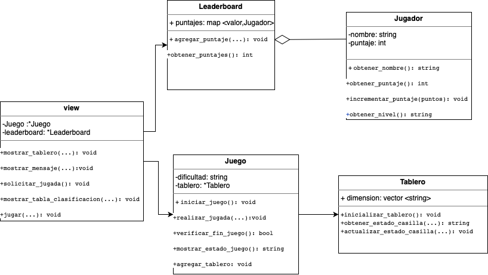

## Ayudas
A continuación verás algunos textos y preguntas que pueden ayudar en el proceso de identificación de las clases, métodos, atributos y relaciones para 
refactorizar el código del ejercicio

### Identificación de Clases Potenciales
Para identificar las clases, piensa en los "nombres sustantivos" que ves en la descripción del proyecto y en las funcionalidades que has observado:
- **Entidades Principales:** ¿Qué sustantivos se mencionan repetidamente? Ejemplo: en un juego, clases como `Jugador`, `Tablero`, `Juego` podrían ser centrales.
- **Grupos de Datos:** ¿Qué información se maneja conjuntamente? Esto podría indicar una clase. Por ejemplo, si se maneja nombre, puntaje, y nivel del jugador, una clase `Jugador` podría encapsular estos datos.
- **Agrupación lógica de funcionalidades**: Si partes del código siempre operan juntas o manejan la misma categoría de datos, probablemente deberían ser una clase. 
 - **Objetos y colecciones**
   - **Arreglos con Posiciones Específicas**
     - Si encuentras arreglos donde cada posición tiene un significado específico (por ejemplo, `datos[0]` siempre es el nombre, `datos[1]` es la dirección, etc.), es un indicativo claro de que esos datos podrían estar mejor representados como atributos de una clase. Acceder a los datos sería más legible y menos propenso a errores usando `objeto.nombre` y `objeto.direccion` en lugar de índices numéricos.

   - **Listas de Tuplas para Representar Objetos**
     - A menudo se utilizan listas de tuplas para representar una colección de objetos. Cada tupla contiene varios elementos relacionados, como por ejemplo, `(nombre, edad, salario)`. Este es un buen candidato para convertirse en una clase `Empleado`, donde cada instancia representa un empleado específico.

   - **Datos Agrupados que se Pasan Juntos**
     - Si pasas grupos de variables juntos a múltiples funciones, esto puede indicar que esos datos están estrechamente relacionados y serían más efectivos como una clase. Por ejemplo, si pasas información sobre un libro como título, autor y año a varias funciones, considera agruparlos en una clase `Libro`.
  
   - **Lógica Compleja que Manipula los Arreglos**
     - Si el código incluye manipulaciones complejas o repetidas de datos almacenados en arreglos o listas, encapsular esta lógica en métodos de una clase puede hacer el código más organizado, reusable y fácil de mantener.
   - **Extensión y Mantenimiento**
     - Si anticipas que los datos o las estructuras podrían expandirse en el futuro, usar clases hace que sea mucho más fácil añadir estas nuevas características sin perturbar el resto del sistema.

### Identificación de Métodos
Los métodos son acciones que las clases pueden realizar. Para definir métodos, busca "verbos" asociados con los sustantivos identificados:
- **Acciones Específicas:** ¿Qué acciones realiza cada entidad principal? Por ejemplo, un `Jugador` podría `incrementar_puntaje()`, `actualizar_nivel()`.
- **Funcionalidades del Sistema:** ¿Qué procesos y operaciones importantes necesita realizar el sistema? Ejemplo: `iniciar_juego()`, `verificar_seleccion()` en la clase `Juego`.
- Observa las tareas que se repiten en diferentes partes del código y que podrían ser centralizadas en un método de una clase
- **Funciones que operan sobre los mismos datos**: Cualquier función que modifique o utilice los mismos datos repetidamente es un candidato para ser un método de una clase. Por ejemplo, las funciones que modifican o leen el estado del juego (reset_board, update_score, check_game_end) podrían ser métodos de una clase Game.
- **Reutilización de código**: Si el mismo bloque de código se utiliza en múltiples funciones, considera convertirlo en un método dentro de una clase para mejorar la reutilización y la claridad

### Identificación de Atributos y Modificadores de Acceso
Los atributos son las características o propiedades de las clases, y los modificadores de acceso definen cómo se puede acceder a estos atributos:
- **Atributos:** Identifica qué información es fundamental para cada clase. Por ejemplo, la clase `Jugador` podría tener atributos como `nombre`, `puntaje`. 
- ¿Cuáles son los datos requeridos al momento de crear un objeto? estos a menudo se convierten en atributos de clase.
- **Modificadores de Acceso:** Decide quién necesita acceder a estos atributos. Utiliza `private` (privado) si solo la propia clase debe acceder a ellos. ¿Existen datos sensibles o críticos que deben ser protegidos de cambios externos?
- Variables compartidas entre funciones: Si varias funciones leen o modifican las mismas variables, esas variables son buenos candidatos para ser atributos de una clase. 
- Datos que definen el estado de un objeto: Cualquier dato que capture información sobre el estado de un sistema o de una entidad dentro de tu aplicación probablemente debería ser un atributo de una clase. Esto incluye configuraciones, contadores como puntajes o tiempos, y estados como el estado actual del juego.

#  Entregable - Mejoras para pasar a POO
Detalla en este markdown lo siguiente: 
- **Clases a Definir:** Enumera las clases que se podrían definir, describe sus propósito y justifica porque crees que es una clase útil para mejorar el programa.
- **Métodos Importantes:** Enumera los métodos principales para cada clase. Incluye una descripción de cuál sería la utilidad de cada método
- **Imagen del UML del diagrama de clases**  Adjunta una imagen del UML del diagrama de clases como una forma visual de planificar y entender la estructura de las clases, métodos, atributos y relaciones que podría tener una versión mejorada del código fuente.
- **Organización de archivos:** Propon una estructura de organización de los archivos de este proyecto para que no queden todos en la raiz principal. Investiga cuáles podrían ser buenas formas de organizar los directorios y a partir de tu investigación indica qué directorios crearías y cómo los organizarías. 

## Clases

### Jugador
- **Propósito:** la idea es representar a una persona que va a jugar el juego.
- **Justificación:** Agrupa los datos relacionados con un jugador, como su nombre, pais, y puntaje(score).

### Tablero
- **Propósito:** el objetivo es representar un tablero del  juego.
- **Justificación:** puede tener como una vector que contenga emoji, la idea es que cada tablero tiene sus propios emojis, tambien sirve para iniciar un juego, verificar estado, gesitonar interacciones.

### Juego
- **Propósito:** sirve para gestionar un juego
- **Justificación:** la idea es que cada juego tenga un nivel de dificultad, que un juego contenga un tablero, ya que se debe seleccionar aleatoriamente. 
### Clase Leaderboard
- **Propósito:** Representar la tabla de clasificación del juego.
- **Justificación:** Permite mantener un registro de los puntajes de los jugadores, seria mas facil mostrar la informacion y ser mas ordenado.

### Clase View
- **Propósito:** Representar la interfaz de usuario del juego.
- **Justificación:** el objetivo que esta clase sea la interaccion con el main, es decir la relacion de la clase view y el jugador, desde aqui va a poder jugar.

## Métodos Importantes

### Clase Jugador

- obtener_nombre(): nos da el nombre del jugador.
- obtener_puntaje(): obtenemos el puntaje del jugador.
- incrementar_puntaje(puntos): incrementa el puntaje del jugador.
- obtener_nivel(): retorna el nivel que selecciono el jugador

### Clase Tablero

- inicializar_tablero(): inicializa el tablero 
- obtener_estado_casilla(...): retorna el estado de una casilla.
- actualizar_estado_casilla(...): actualiza el estado de una casilla.

### Clase Juego

- iniciar_juego(): inicia una nueva partida.
- realizar_jugada(...): realiza la jugada del jugador.
- verificar_fin_juego(): verifica si se ha alcanzado el final del juego.
- mostrar_estado_juego(): muestra el estado actual del juego en el tablero.
- agregar_tablero: añade un tablero al juego
### Clase Leaderboard

- agregar_puntaje(...): agrega el puntaje de un jugador.
- obtener_puntajes(): retorna los puntajes de todos los jugadores.

### Clase View

- mostrar_tablero(...): muestra el estado actual del tablero.
- mostrar_mensaje(...): muestra un mensaje en la interfaz de usuario.
- solicitar_jugada(): solicita al usuario que realice una jugada y retorna las coordenadas ingresadas.
- mostrar_tabla_clasificacion(...): muestra la tabla de clasificación en la interfaz de usuario.
-jugar(...): juega
## Imagen del UML del diagrama de clases

## Organización de archivos

- source/
    - docs/
        - ( documentación )
        - ...
    - main/
        - jugador.py
        - leaderboard.py
        - tablero.py
        - juego.py
    - view/
        - view.py
        - main.py
    - img/
        - (archivos de recursos gráficos)
        - ...
    - venv/
        - (archivos del entorno virtual)
        - ...
- requirements.txt
